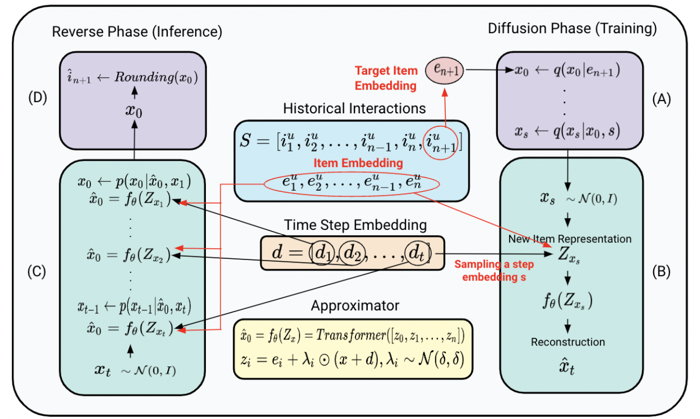
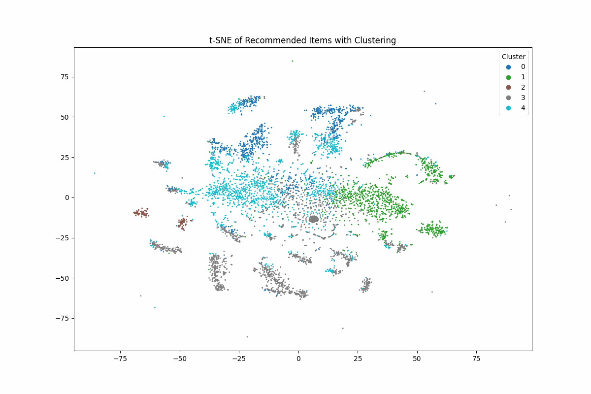

# DiffuRecSys: A Novel Diffusion-Based Framework for Sequential Recommendations
## Overview
Generative models, such as Variational Autoencoders (VAEs) and Generative Adversarial Networks (GANs), have shown great potential in sequential recommendation. However, these models face significant challenges, including posterior collapse and a limited ability to represent user preferences. We extend the architecture proposed by Li et al. (2023) which represents item embeddings as distributions. This work introduces novel enhancements to the DiffuRec architecture, significantly improving user interaction predictions by incorporating offset noise and cross-attention mechanisms. This novel approach allows for a more adaptive reflection of users' diverse interests and various item aspects.

During the diffusion phase, the target item embedding is transformed into a Gaussian distribution by introducing noise, which facilitates the modeling of sequential item distributions and the incorporation of uncertainty. Our model, DiffuRecSys, enhances the original DiffuRec architecture by:

* Incorporating Cross-Attention Mechanisms: We embed cross-attention within the Approximator to better capture the relationships between past user interactions and the target item, thus enriching the representation of user preferences.

* Adding Offset Noise in the Diffusion Process: This addition increases model robustness and effectively manages variability in user interactions, leading to improved performance.

* Extensive Experimental Validation: We conduct thorough experiments across three public benchmark datasets, demonstrating that DiffuRecSys outperforms existing baselines and effectively captures diverse user preferences.


## Key Features
Generative Modeling: Utilizes diffusion models for sequential recommendations, enhancing the way user preferences are captured and item distributions are represented.

Cross-Attention Mechanisms: This enables the model to dynamically adjust and focus on the most relevant past interactions, improving prediction accuracy.

Robustness through Offset Noise: By introducing offset noise during the diffusion process, the model can better handle variabilities in user behavior.

Comprehensive Experimental Framework: A well-structured approach to experimentation, with results demonstrating the efficacy of our enhancements over standard models.

## Model Architecture
The DiffuRec framework employs a two-phase process:

* Diffusion Phase: This phase involves converting item embeddings into noisy representations via Gaussian distributions, effectively capturing latent aspects of the items.

* Reverse Phase: The model iteratively reconstructs the target item representation from noisy inputs, culminating in a final prediction of the next item the user is likely to interact with.

The architecture leverages a Transformer-based Approximator to process historical user interactions and produce refined item embeddings. Key components include:

* Noising and Sampling: Implementing noise sampling techniques to enhance the model's adaptability to different user behaviors.

* Rounding Function: A mechanism to convert continuous item representations into discrete indices for final predictions.



## Installation

Prerequisites:
* Python 3.8+
* PyTorch
* RecBole (for dataset management)
  
To use DiffuRecSys, clone this repository and install the necessary dependencies:
```bash
git clone https://github.com/yourusername/DiffuRecSys.git
cd DiffuRecSys
pip install -r requirements.txt
````

## Datasets
We have utilized three public benchmark datasets for our experiments:

* Amazon (Beauty and Toys subcategories): User reviews of products.
* MovieLens 1M: A widely recognized dataset comprising approximately 1 million user ratings on movies.

## Results
Comprehensive results from our experiments demonstrate the improvements of DiffuRecSys over baseline models. Detailed evaluations can be found in the paper and accompanying results files.




## Conclusion
DiffuRecSys represents a significant advancement in the field of sequential recommendation systems, providing robust mechanisms for capturing user preferences and improving prediction accuracy through innovative architectural enhancements.


